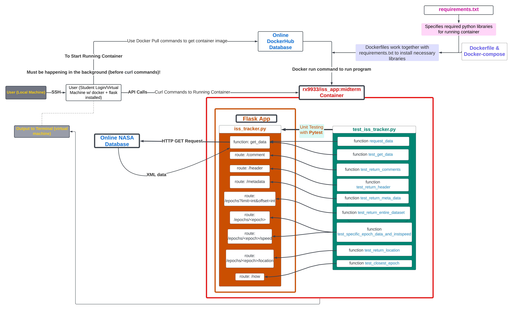

# International Space Station Tracker App: COE 332 Midterm 

This project analyzes the International Space Station's position and velocity based on data provided by NASA. The program supports Flask and Docker, and returns general information about the ISS and specific parameters about the ISS's location/speed at different time points. 

## Table of Contents:
1. [Folder Contents](#folder-contents): description of files in this ISS-Tracker repository.
2. [Data Source](#data-source): data of ISS location/position.
3. [Diagram](#diagram): program diagram.
4. [Prerequisites](#prerequisites): requirements to run program.
5. [Running App](#running-app): instructions to run app.
6. [Contributions/Citations](#contributionscitations): other authors or sources that assisted in developing this project.

## Folder Contents:
1. "iss_tracker.py": code that requests data about the ISS's position/velocity based on user's flask commands.
2. "test_iss_tracker.py": contains unit tests for iss_tracker.py. 
3. "requirements.txt": the required versions of python libraries (used in Dockerfile).
4. "Dockerfile": contains instructions for docker to work (building/running program).
5. "docker-compose.yml":  containerized docker commands (for automation purposes).
6. "diagram.png": diagram of program (shows user-app interaction).
7. "README.md": this file, describes functionality of app.

## Data Source

Data is sourced from NASA's public data repository: [NASA ISS Website](https://spotthestation.nasa.gov/trajectory_data.cfm). The xml formatted data is used for this project. 
To directly download the data: [Download NASA ISS XML Data](https://nasa-public-data.s3.amazonaws.com/iss-coords/current/ISS_OEM/ISS.OEM_J2K_EPH.xml). 

1. Data tracks the ISS, providing the location (x, y, and z coordinates) and the velocity (in the x, y, and z directions) at different times/epochs.
2. For the xml data type, the epochs are given in the following format: 2024-043T12:00:00.000, where this time represents the 43rd day from January 1st, 2024 (February 12th) at time 12:00:00 p.m. in UTC (Coordinated Universal Time, located in London, England). All times in the data are presented in UTC format.
3. Positional and velocity data is recorded in kilometers (km) and kilometers per second (km/s). 
4. Various statistics about the ISS are also provided (i.e, the mass of the ISS, drag area, drag coefficient, etc.)
5. The start and stop dates of data collection are also provided. 

## Diagram
A software diagram of the entire ecosystem is presented below:


This image shows how the different programming files work together and how the user should interect with the app.

## Prerequisites
Ensure that Docker is installed in system directory. View https://docs.docker.com/engine/install/ for more information.

For unit testing purposes, git clone this repository (ISS-Tracker) and navigate to this directory. Then proceed with [Running App](#running-app)(next steps). 
## Running App
### Running Container
Enter the following commands in terminal (that satisfies specified [Prerequisites](#prerequisites)).
1. To pull image (from Dockerhub):
```bash
docker pull rx9933/iss_app:midterm
```
2. To run Docker container:
```bash
docker run --name "iss-app" -d -p 5000:5000 rx9933/iss_app:midterm
```

### Making Requests to Container
Note: Proceed only if "Running Container" is completed. Run the following commands in the same (or a different terminal that satisfies the [Prerequisites](#prerequisites))
1. To return comments in ISS data set:
```bash
curl localhost:5000/comment
```
2. To return header in ISS data set:
```bash
curl localhost:5000/header
```
3. To return metadata in the ISS data set (general information about the ISS):
```bash
curl localhost:5000/metadata
```
4. To return the entire data set (or modified list of Epochs given query parameters):
For entire data set:
```bash
curl localhost:5000/epochs
```
For restricted modified list of Epochs given query parameters:
```bash
curl "localhost:5000/epochs?limit=<ANY INTEGER>&offset=<ANY INTEGER>"
```
Note: limit is the maximum number of data points returned and offset is offset from the starting data point (begin returning ISS data points after <offset> number of data points).In place of "ANY INTEGER" input appropriate limit and/or offset values (integers).
Limit and offset are optional parameters (input both, one, or neither of the options).
* With the limit and offset parameters, the program will return the <limit> number of data points beginning after the <offset> number of data points.
Command example:
```bash
curl "localhost:5000/epochs?limit=2&offset=200"
```
Note the quotation marks when inputting two arguments. If two arguments/query parameters are provided without being surrounded in quotes (as shown in above command), the program will only consider the first parameter. Additionally, after returning the data section, the program will continue running, rather than moving on to an empty new line. Use command CTRL+C to exit, and instead use the quotations in curl command for desired output.

* With just a limit parameter, the program will return the <limit> number of data points beginning at the start of the ISS data
Command example:
```bash
curl localhost:5000/epochs?limit=2
```
* With just an offset parameter, the program will return all the data points after the <offset> number of data points.
Command example:
```bash
curl localhost:5000/epochs?offset=3
```

5. To return the data at a particular epoch:
```bash
curl localhost:5000/epochs/<epoch>
```
Replace "epoch" with a particular time stamp, i.e, 2024-066T23:46:00.000Z. 
Command example:
```bash
curl localhost:5000/epochs/2024-074T23:46:00.000Z
```
Ensure time stamp is in UTC time, and formatted as in the example. If "No data found at particular epoch." is output, the epoch may not be of correct format or data for that time may not exist (i.e, the ISS's location/speed has not been predicted for the specific timestamp, the ISS has long since passed that time point, or the time is beyond the predicted range for the ISS data).

6. To return the ISS' instantaneous speed for a specific Epoch in the data set:
```bash
curl localhost:5000/epochs/<epoch>/speed
```
Command example:
```bash
curl localhost:5000/epochs/2024-053T23:12:00.000Z/speed
```
As above in 5., replace "epoch" with desired time stamp (follow format in 3.). If the message "No data found at particular epoch. Cannot calculate instantaneous speed." appears, the limitations as described in 3. are likely the cause of the issue.

7. To return the latitude, longitude, altitude, and geoposition for a specific epoch:
```bash
curl localhost:5000/epochs/<epoch>/location
```
As above in 5. and 6., replace "epoch" with desired time stamp (follow format in 3.). If the message "No data found at particular epoch. Cannot calculate instantaneous speed." appears, the limitations as described in 3. are likely the cause of the issue.
Note: geolocation represents the city above which the ISS is traveling. When the ISS is not above land (above an ocean), the program will return "geolocation/city: None".

8. To return the instantaneous speed, latitude, longitude, altitude, and geoposition for the Epoch that is nearest to the current UTC time:
```bash
curl localhost:5000/now
```
As above in 7., if the ISS is currently above an ocean, the geolocation/city will be returned as None.


### Unit Testing
1. Follow "To Build Image", then, in the same directory as the ISS-Tracker repository, run the following command:
```bash
pytest
```
Note: a different terminal (as long as it has Docker installed and has been navigated to the ISS-Tracker directory) can run the "pytest" command, as long as the docker image has been correctly pulled and is running (view "To Build Image").

## Contributions/Citations
* Professor Joe Allen: on providing calculation help (math) for the seventh route (returning latitude, latitude, longitude, altitude, and geoposition for a specific epoch) and immediate help for all my questions.
* ChatGPT: on writing this README.md.
* [COE 332: Software and Engineering Design Read The Docs](https://coe-332-sp24.readthedocs.io/en/latest/unit05/containers_2.html): on usage (running the program with Linux commands)
* [NASA ISS Website](https://spotthestation.nasa.gov/trajectory_data.cfm): on providing data.
